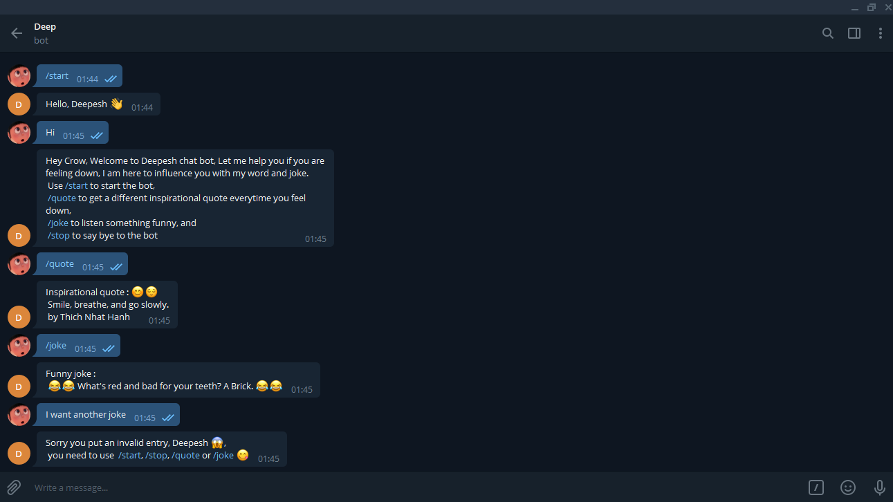

# telegram_bot

I am introducing this telegram bot which can introduce himself when you say hi to him. This bot can send you inspirational quotes and funny jokes to you when you press certain commands and also instruct you if you press any wrong key. 





# Getting Started 🚀

These instructions will get you a copy of the project up and running on your local machine.


## How To Use 🔧

From your command line, first clone the project:

```bash
# Clone this repository
$ git clone https://github.com/Dipeshtwis/telegram_bot.git

# Go into the folder Tic-tac-toe where the game is present
$ cd telegram_bot

# Navigate to bin folder
$ cd bin

# In command prompt, run the following command
$ ./main.rb


# Go to telegram app Desktop/Mobile

# Search for
     
     @Deepeshbot

  
Start the chat by saying 'Hi', 'hi', 'Hello', 'hello' or  '✋'

and enjoy by writing any commands
```


## How To Run the test 🔧

From your command line, first clone the project:

```bash
# Install the Rspec
$ gem install Rspec

# Initialize the Rspec
$ rspec --init

# In command prompt, run the following command to test
$ rspec

```


## Tools and technology used

- Ruby 2.7.x
- Telegram (BotFather) BOT API
- Type-fit Quotes API
- Rapid Joke API


## CONTRIBUTOR

​
👤 **Dipesh Kumar**

- [Github](https://github.com/Dipeshtwis)
- [Twitter](https://twitter.com/97deepeshkumar)
- [Linkedin](https://www.linkedin.com/in/dipesh-kumar-b6ab88134/)


# Github link:

For the: [Github-link](https://github.com/Dipeshtwis/telegram_bot)


## Show your support

Give a ⭐️ if you like this project!

## Acknowledgments

- Thanks to Microverse and The Odin Project.
- Thanks to [notion](https://www.notion.so/Build-your-own-bot-ebd0d7ac5da240e5987720bdc83f38fa) website.
- Thanks to [Atipugin](https://github.com/atipugin/telegram-bot-ruby) github repository.
